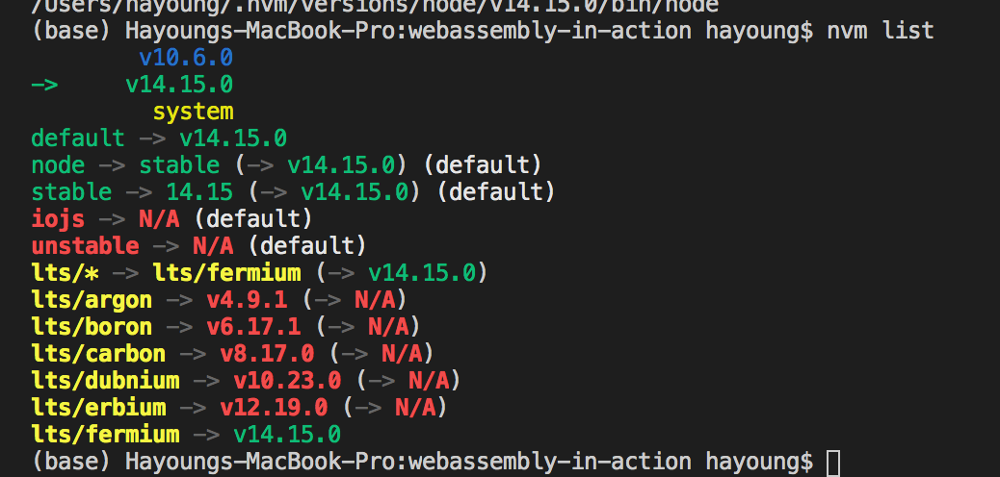

# webassembly-in-action
Follow webassembly in action


## 환경 설정
1. 가상환경이용해서(venv) python 3버전 설치하기(최소 2.7 이상이 필요) - [가상환경 관련 글](https://www.daleseo.com/python-venv/)
```
python3 -m venv .env
. .env/bin/activate
```

2. python3에 기본적으로 내장되어있는 로컬 웹서버를 이용
```
python -m http.server 8080
```

3. [emscripton 설치](https://emscripten.org/docs/getting_started/downloads.html)
```
git clone https://github.com/emscripten-core/emsdk.git
cd emsdk
./emsdk install 1.38.45
source ./emsdk_env.sh // 환경변수 설정, 캐쉬 안되기 때문에 따로 설정
```

- 환경변수 설정(https://life-of-panda.tistory.com/41)(https://elfinlas.tistory.com/266)
```
echo 'export PATH="$PATH:/Users/hayoung/Desktop/Github Repos/webassembly-in-action/emsdk"' >> ~/.bash_profile

echo 'export PATH="$PATH:(your source ./emsdk_env.sh result)"' >> ~/.bash_profile

export PATH="$PATH:/Users/hayoung/Desktop/Github Repos/webassembly-in-action/emsdk" // open .bash_profile
```


4. Emiscripton and Node
나는 내 컴퓨터에 nvm 으로 node를 관리하고 있었는데, emiscripton 이 node를 또 가져오네.
[이거](https://github.com/emscripten-core/emscripten/issues/4848)이건 나와 같은 의문을 가졌던 분!

- nvm list 결과

nvm은 node 14

- emsdk list 결과

emscripton은 12

잘모르겠으니 일단 넘어가자

5. wabt
https://github.com/WebAssembly/wabt#:~:text=WABT%20(we%20pronounce%20it%20%22wabbit,of%20tools%20for%20WebAssembly%2C%20including%3A&text=wasm%2Dinterp%3A%20decode%20and%20run,wat%2Ddesugar%3A%20parse%20.

이건 뭔가 사용하는건가본데, 아직 잘 모르겠다!


